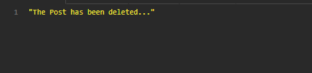

<h1>EDPOINT DELETE DE POST</h1>

<h3>Se envia el id por <strong>params</strong> </h3>
<h3>Path: 'http://localhost:3001/api/posts/:id' </h3>
 

<h5>Request por <strong>headers</strong> </h5>

Se debe enviar por header el accessToken del usuario para realizar el delete del usuario

    {
        headers: {
            token: "token del usuario"
        }
    }

 
<h5>Method: <strong>DELETE</strong> </h5>

 
<h5><strong>RESPONSE</strong></h5>
