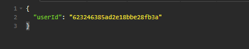
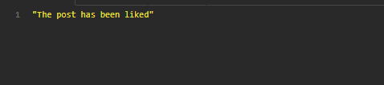
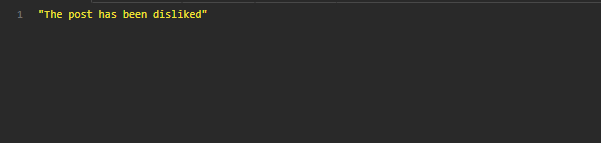

<h1>ENDPOINT PARA DAR LIKE/DISLIKE A UN POST</h1>

<h3>Todos los posts Path: http://localhost:3001/api/posts/:id/like </h3>
 
 

Model:

    {
	"userId": "623246385ad2e18bbe28fb3a"
    }

<h5>Request por  <strong>BODY</strong> </h5>
 
<h5>Method: <strong>PUT</strong> </h5>

 
 
<h5><strong>Response: Se hace la misma peticion para un like/dislike y se alterna este mismo cada peticion</strong></h5>
 
<h5><strong>Se manda la primera vez para un like:</strong></h5>

 
<h5><strong>Se manda la segunda vez para un dislike:</strong></h5>
