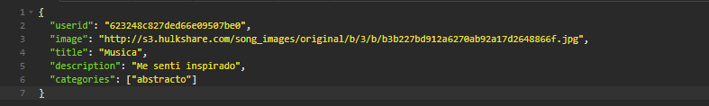
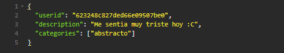
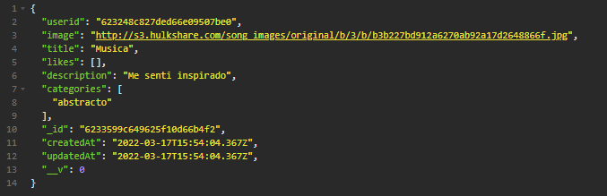
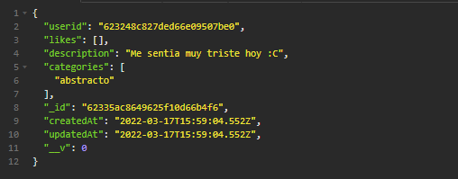

<h1>EDPOINT CREAR UN POST</h1>

<h3>Path: http://localhost:3001/api/posts </h3>
 

Model

    {
	"userid": "623248c827ded66e09507be0",
	"image": "http://s3.hulkshare.com/song_images/original/b/3/b/b3b227bd912a6270ab92a17d2648866f.jpg",
	"title": "Musica",
	"description": "Me senti inspirado",
	"categories": ["abstracto"]
    }

<h5>Request por  <strong>BODY</strong> </h5>
 
<h5>Method: <strong>POST</strong> </h5>

 
<h5>Tambien puede enviar sin imagen y/o titulo</h5>

 
 
<h5><strong>Response</strong></h5>

 
<h5>Sin imagen y/o titulo</h5>
