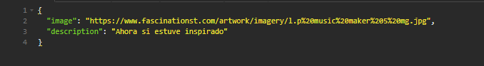
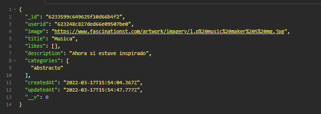

<h1>EDPOINT EDITAR UN POST</h1>

<h3>Path: http://localhost:3001/api/posts/:id </h3>
 

Model: Solo las propiedades a editar

    {
	"image": "https://www.fascinationst.com/artwork/imagery/l.p%20music%20maker%205%20mg.jpg",
	"title": "Musica",
	"description": "Ahora si estuve inspirado",
    }

<h5>Request por  <strong>BODY</strong> </h5>
 
<h5>Method: <strong>PUT</strong> </h5>

 
 
<h5><strong>Response</strong></h5>
