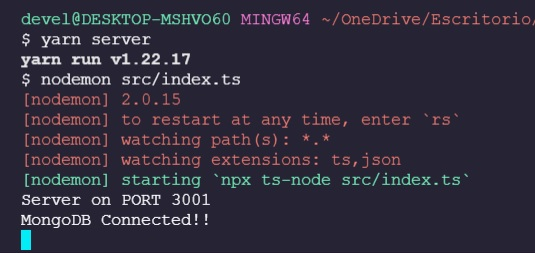

<h1>START SERVER</h1>
 

Primero entrar a la carpeta raiz

<h3>cd back/</h3>
 

Instalar dependencias del package.json con:

<h3>npm install<h3>

o

<h3>yarn<h3>
 

Iniciar server con:

<h5><strong>npm server</strong> </h5>
 
<h5><strong>yarn server</strong> </h5>
 

<strong>Server funcionando bien =></strong>

