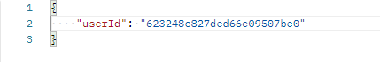
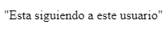

<h1>EDPOINT FOLLOWS</h1>

<h4>Path por body: </h4>
<h3>Path: http://localhost:3001/api/:id/follow </h3>

<h4>Path por params: </h4>
<h3>Path: http://localhost:3001/api/:id/unfollow </h3>
 

Model

    {
    followers: number []
    following: number [];
    }

 
<h5>Request por  <strong>BODY</strong> </h5>
 
<h5>Method: <strong>PUT</strong> </h5>

 
<h5><strong>Response</strong></h5>

