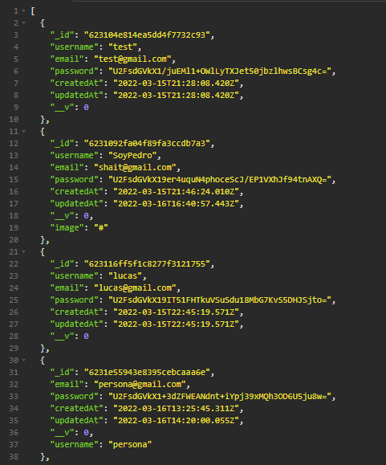
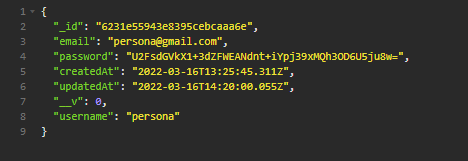

<h1>ENDPOINT OBTENER TODOS LOS USUARIOS O UNO EN ESPECIFICO</h1>

<h3>Todos los usuarios Path: http://localhost:3001/api/users </h3>
 
 
<h5><strong>Response</strong></h5>

 
 

<h3>Un usuario en especifico Path: http://localhost:3001/api/users/:id </h3>
 
 
<h5><strong>Response</strong></h5>
