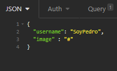
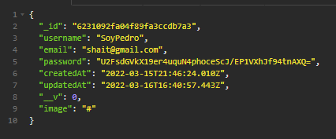

<h1>EDPOINT REGISTRO DE ACTUALIZACION Y ELIMINACION DE USUARIO</h1>

<h3>Actualización Path: http://localhost:3001/api/user/:id </h3>
 

Model

    {
    username: "SoyPedro"
	image : "#"
    }

<h5>Request por  <strong>BODY</strong> </h5>
 
<h5>Method: <strong>PUT</strong> </h5>

 
 
<h5><strong>Response</strong></h5>

 
 
<h3>Eliminar usuario Path: http://localhost:3001/api/user/:id </h3>
 

<h5>Method: <strong>Delete</strong> </h5>

 
<h5><strong>Response</strong></h5>
