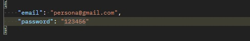
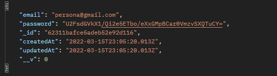

<h1>EDPOINT REGISTRO DE USUARIO</h1>

<h3>Path: http://localhost:3001/api/register </h3>
 

Model

    {
    email: string; // => Requerido
    password: string; // => Requerido
    username?: string;
    image?: string;
    }

<h5>Request por  <strong>BODY</strong> </h5>
 
<h5>Method: <strong>POST</strong> </h5>

 
 
<h5><strong>Response</strong></h5>

