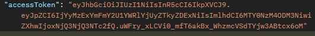
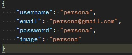
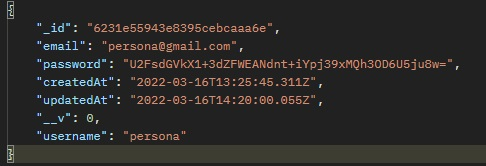

<h1>EDPOINT UPDATE DE USUARIO</h1>

<h3>Se envia el id por <strong>params</strong> </h3>
<h3>Path: `http://localhost:3001/api/user/${id}` </h3>
 

Model de datos de usuario para modificar 

    {
        email?: string;
        password?: string;
        username?: string;
        image?: string;
    }

 
<h5>Request por <strong>headers</strong> </h5>

Se debe enviar por header el accessToken del usuario para realizar modificaciones en el mismo

    {
        headers: {
            token: "token del usuario"
        }
    }

 
<h5>Method: <strong>PUT</strong> </h5>
<h5>Request por <strong>BODY</strong> </h5>

Se debe enviar aunque sea uno de los datos a modificar por body

 

 
<h5><strong>RESPONSE</strong></h5>

